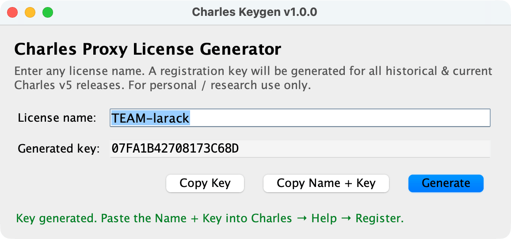

<p align="center">
  
</p>

<h1 align="center">charles-crack</h1>

<p align="center"><a href="README_zh.md">中文</a> | <b>English</b></p>

Open-source Charles Proxy license keygen, implemented from scratch with the RC5 block cipher. Compatible with every
historical Charles 3.x / 4.x / 5.x release.

This repo ships a small, dependency-free Java codebase plus build scripts that produce:

- A cross-platform **runnable JAR** — works anywhere a JRE 11+ is installed.
- **Native desktop bundles / installers** via `jpackage`:
    - **macOS** → `.dmg` installer + zipped `.app` bundle
    - **Windows** → `.exe` launcher + `.msi` installer + self-contained zip
    - **Linux** → self-contained `.tar.gz` of the app-image



All artifacts land in [`release/`](release) with a stable, per-platform naming convention (see below).

> ⚠️ For educational and research purposes only. Please purchase a legitimate Charles license
> at <https://www.charlesproxy.com/latest-release/download.do> if you use it for work.

---

## Project layout

```
charles-crack/
├── assets/
│   ├── logo.svg             # Vector logo (source of truth)
│   ├── logo.png             # 512×512 raster (Linux icon)
│   ├── logo.icns            # macOS icon bundle
│   ├── logo.ico             # Windows multi-resolution icon
│   └── logo-{16..1024}.png  # PNG export sizes
├── src/
│   ├── Main.java            # Cross-platform entry point: GUI + CLI + --help
│   ├── CharlesKeygen.java   # Key derivation logic (license name → license key)
│   └── RC5.java             # Pure-Java RC5-32/12/16 implementation
├── build.sh                 # Build script for macOS / Linux (bash)
├── build.bat                # Build script for Windows (cmd)
├── build/                   # Intermediate output (classes, MANIFEST, fat JAR)
├── dist/                    # Raw jpackage output, per OS (.app, .dmg, .exe, ...)
└── release/                 # Final, renamed, ready-to-ship artifacts
```

## Release artifacts & naming

All final binaries go into [`release/`](release). The naming convention is:

```
CharlesKeygen-<version>[-<os>-<arch>][-<variant>].<ext>
```

| Platform                  | File                                                                                                                    |
|---------------------------|-------------------------------------------------------------------------------------------------------------------------|
| **Universal**             | `CharlesKeygen-1.0.0.jar`                                                                                               |
| **macOS (Apple Silicon)** | `CharlesKeygen-1.0.0-macos-arm64.dmg`<br>`CharlesKeygen-1.0.0-macos-arm64-app.zip`                                      |
| **macOS (Intel)**         | `CharlesKeygen-1.0.0-macos-x64.dmg`<br>`CharlesKeygen-1.0.0-macos-x64-app.zip`                                          |
| **Windows x64**           | `CharlesKeygen-1.0.0-windows-x64.exe`<br>`CharlesKeygen-1.0.0-windows-x64.zip`<br>`CharlesKeygen-1.0.0-windows-x64.msi` |
| **Linux x64**             | `CharlesKeygen-1.0.0-linux-x64.tar.gz`                                                                                  |
| **Linux arm64**           | `CharlesKeygen-1.0.0-linux-arm64.tar.gz`                                                                                |

`jpackage` can only build native installers for the OS it runs on — run `build.sh` / `build.bat` on each target OS (or
wire it up in CI) for full coverage. The `.jar` is produced on every run and is always cross-platform.

## Requirements

- **JDK 17 or newer** is recommended (required for `jpackage` native bundling).
    - JDK 11+ is sufficient if you only want the runnable JAR.
- Platform-specific bundling tools used by `jpackage`:
    - **macOS**: Xcode Command Line Tools (`xcode-select --install`)
    - **Windows**: [WiX Toolset 3.x](https://wixtoolset.org/releases/) on `PATH` (for `.msi`)
    - **Linux**: `fakeroot` + `dpkg` (for `.deb`) or `rpmbuild` (for `.rpm`)

Verify your toolchain:

```bash
java  -version
javac -version
jpackage --version
```

## Build

### macOS / Linux

```bash
./build.sh
```

### Windows

```cmd
build.bat
```

Both scripts perform the same pipeline:

1. Compile `src/*.java` → `build/classes/`
2. Package a runnable JAR → `build/charles-keygen.jar` (manifest sets `Main-Class: Main`)
3. Invoke `jpackage` with the platform icon from `assets/` to produce native artifacts under `dist/<os>/`
4. **Copy / rename everything into `release/` with the naming convention above**

Example output on Apple Silicon macOS:

```
release/
├── CharlesKeygen-1.0.0.jar
├── CharlesKeygen-1.0.0-macos-arm64.dmg
└── CharlesKeygen-1.0.0-macos-arm64-app.zip
```

## Usage

### 1. GUI (double-click / launch app)

Install from the native bundle for your OS (`.dmg` / `.msi` / `.tar.gz`) or run the JAR directly:

```bash
java -jar release/CharlesKeygen-1.0.0.jar
```

A small Swing window opens. Enter any license name, press **Generate**, and the key is filled in and ready to copy.

### 2. Command line

```bash
# Shortcut: single positional arg
java -jar release/CharlesKeygen-1.0.0.jar "Your Name"

# Explicit CLI flag
java -jar release/CharlesKeygen-1.0.0.jar --cli "Your Name"

# Help
java -jar release/CharlesKeygen-1.0.0.jar --help
```

Sample output:

```
Charles Proxy - License Key Generator [ALL VERSIONS]
* GENERATED LICENSE:
  Name: Your Name
  Key:  44E7A0EAFB50CCD696
```

## Applying the license to Charles

1. Open **Charles → Help → Register Charles…**
2. Paste the **Name** and **Key** exactly as generated.
3. Restart Charles.

If Charles refuses to launch on newer macOS versions due to license verification, also add the official fake-license
patch (see the Charles docs) — this keygen generates keys that pass the local RC5 check, but network-based verification
is out of scope.

## How it works (brief)

Charles encodes the license key as:

```
Key = RC5-encrypt( f(name) , staticKey ) formatted as hex
```

where:

- `f(name)` derives a 64-bit block from the license name using a small custom mix.
- `staticKey` is the well-known 128-bit RC5 key embedded in every Charles build since 3.x.

`RC5.java` implements RC5-32/12/16 (32-bit words, 12 rounds, 16-byte key), and `CharlesKeygen.java` wires it together.
See the source for the exact algorithm.

## Regenerating the logo / icons

The logo source lives in `assets/logo.svg`. If you edit it, regenerate the platform icons with:

```bash
cd assets
for s in 16 32 64 128 256 512 1024; do
  rsvg-convert -w $s -h $s logo.svg -o logo-${s}.png
done

# macOS .icns
mkdir -p logo.iconset
cp logo-16.png   logo.iconset/icon_16x16.png
cp logo-32.png   logo.iconset/icon_16x16@2x.png
cp logo-32.png   logo.iconset/icon_32x32.png
cp logo-64.png   logo.iconset/icon_32x32@2x.png
cp logo-128.png  logo.iconset/icon_128x128.png
cp logo-256.png  logo.iconset/icon_128x128@2x.png
cp logo-256.png  logo.iconset/icon_256x256.png
cp logo-512.png  logo.iconset/icon_256x256@2x.png
cp logo-512.png  logo.iconset/icon_512x512.png
cp logo-1024.png logo.iconset/icon_512x512@2x.png
iconutil -c icns logo.iconset -o logo.icns
rm -rf logo.iconset

# Windows .ico (ImageMagick)
magick logo-16.png logo-32.png logo-64.png logo-128.png logo-256.png logo.ico

# Linux PNG
cp logo-512.png logo.png
```

## Troubleshooting

| Symptom                                             | Fix                                                                               |
|-----------------------------------------------------|-----------------------------------------------------------------------------------|
| `jpackage: command not found`                       | Install JDK 17+ and make sure `$JAVA_HOME/bin` is on `PATH`.                      |
| `jpackage` fails on Windows with WiX error          | Install WiX 3.x and add its `bin/` to `PATH`, or build only the `app-image` type. |
| `jpackage` fails on Linux with "Cannot find dpkg"   | Install `fakeroot dpkg` (Debian/Ubuntu) or `rpm-build` (Fedora/RHEL).             |
| GUI doesn't open on Linux over SSH                  | You need an X11/Wayland display; use the CLI mode instead.                        |
| `UnsupportedClassVersionError` when running the JAR | Upgrade your JRE to 11+ (17+ recommended).                                        |

## License

Source code is released under the MIT License — see [LICENSE](LICENSE).

"Charles" and "Charles Proxy" are trademarks of XK72 Ltd. This project is not affiliated with, endorsed by, or sponsored
by XK72 Ltd.
